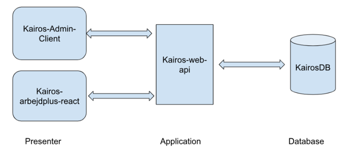
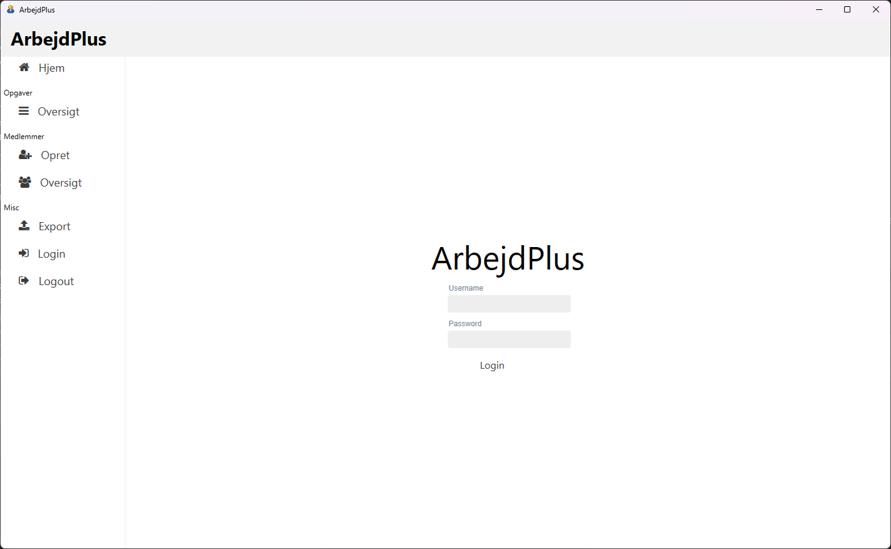
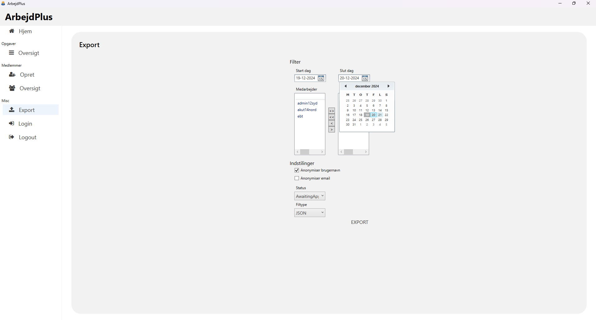
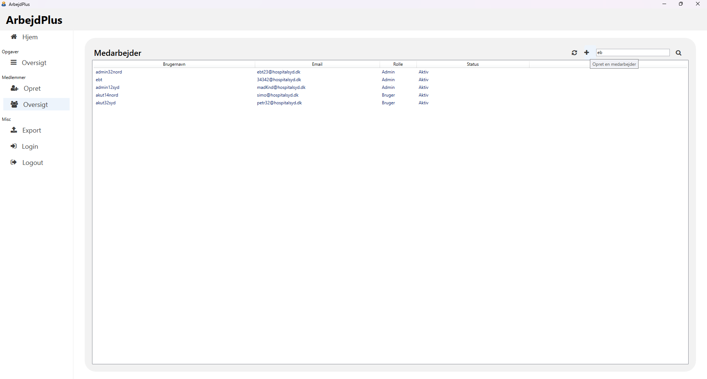
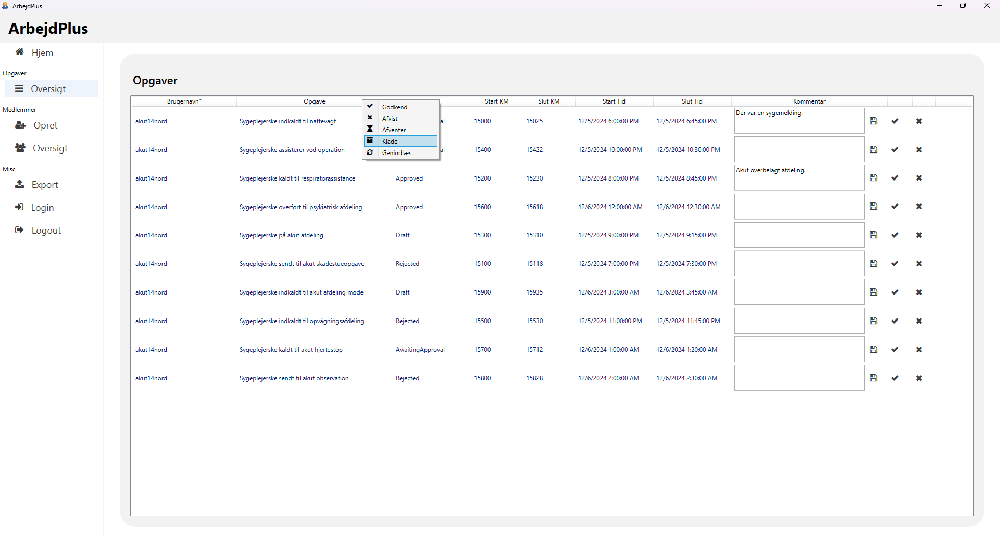
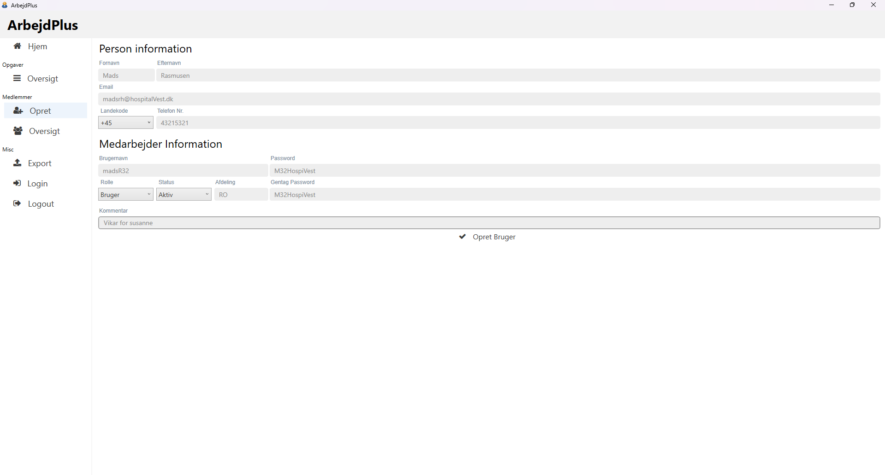
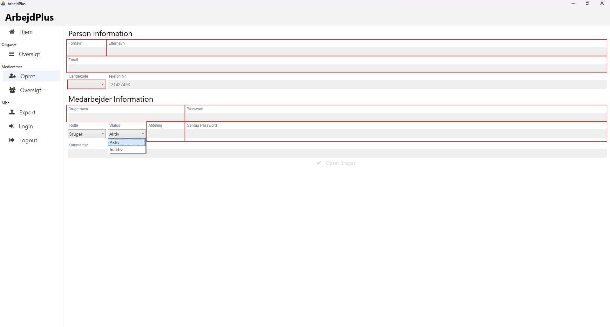
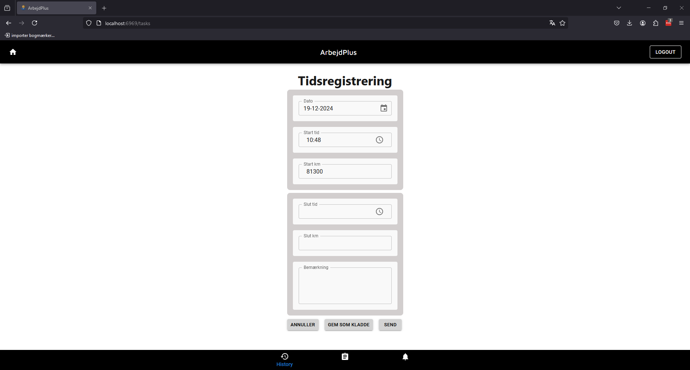
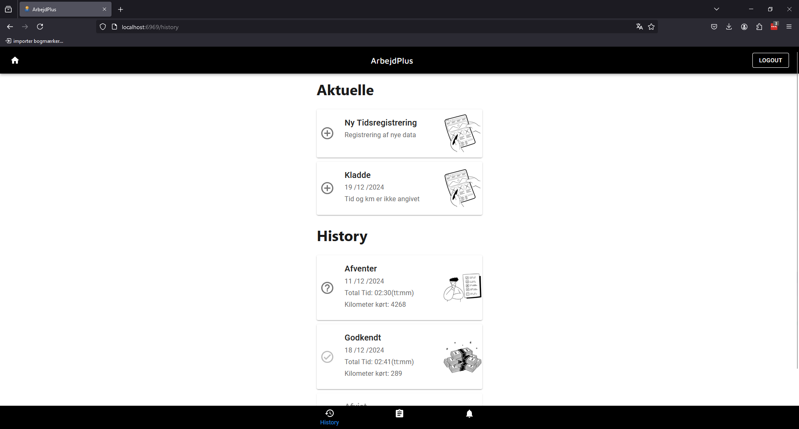
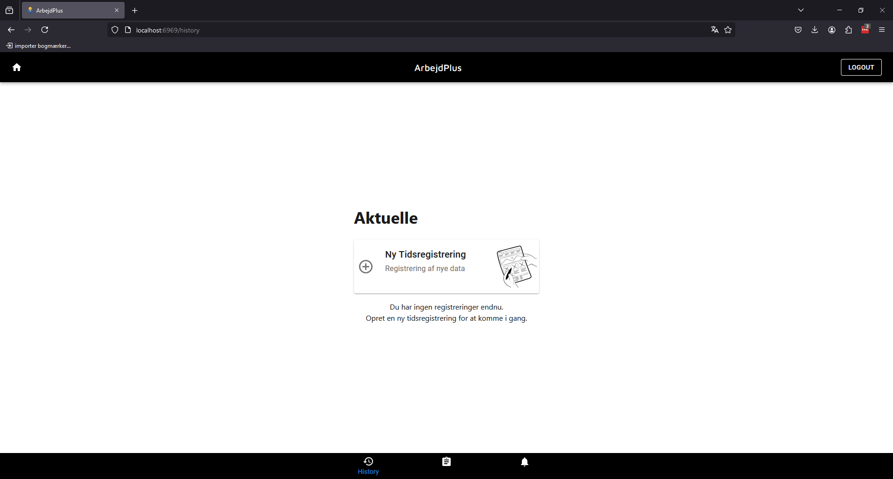

# ArbejdPlus

## Vision

Systemet skal fungere som et distribueret system, der understøtter registrering af ekstra arbejdsopgaver. Hver medarbejder
kan oprette og registrere egne arbejdsopgaver med relevante detaljer om opgaven. Derudover skal medarbejderen kunne
se en oversigt over tidligere registrerede arbejdsopgaver samt redigere opgaver, der endnu ikke er blevet godkendt eller
afsluttet. Systemadministratoren får adgang til funktioner, der giver et overblik over det registrerede ekstraarbejde,
herunder mulighed for at eksportere data til et eksternt system for videre behandling. Desuden skal systemet give mulighed
for at administrere medarbejderprofiler, herunder tilføjelse, redigering og fjernelse af brugere. Det skal også være
muligt at opsætte specifikke restriktioner for individuelle brugere, afhængigt af deres behov og adgangsniveau.

## Arkitektur

Systemet er opdelt i en 3-lags arkitektur (3-tier architecture) med to klienter: en WPF-klient og
en webklient. Applikationslaget, som begge klienter tilgår, er udviklet i C# .NET med ASP.NET
Web API. Systemet benytter en NoSQL MongoDB-database som datalager

## Frontend

### Admin klient.

### Web klient.

